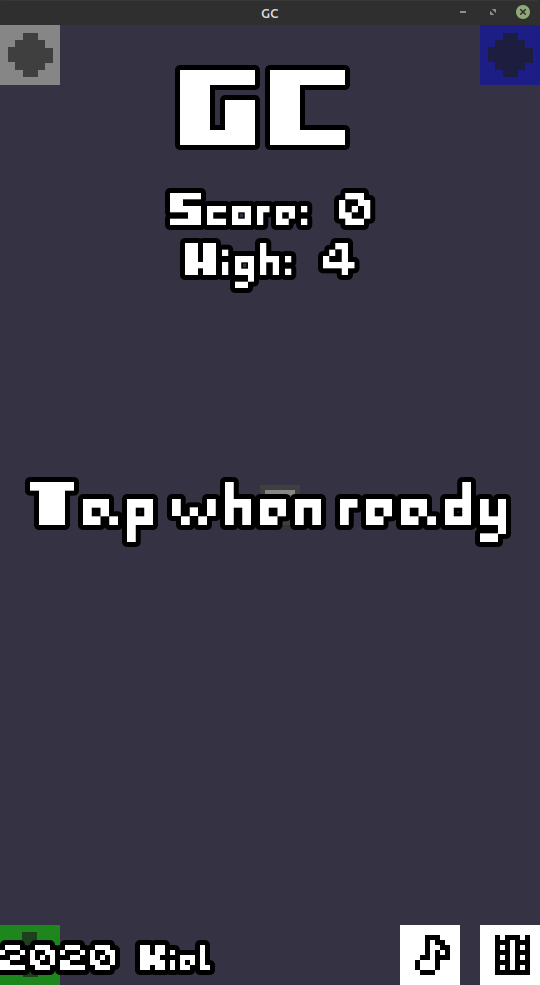
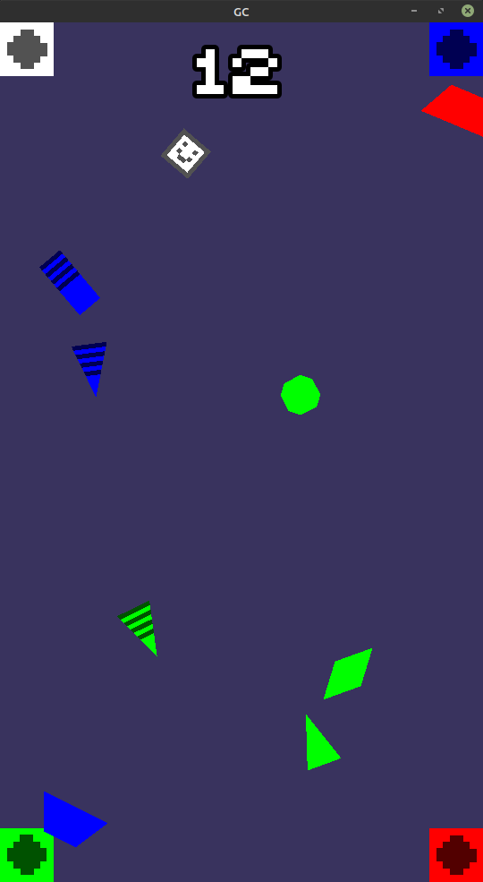

# GC
My project I worked on for (Easy Jam) 8-bits to Infinity - Theme "No Enemies" (10-17 April 2020)

Rules are very simple. You controll a small square smile floating in area with four different coloured bins. Your objective is to collide with ever spawning junks around space and push them to properly coloured bin. If you push junk and it goes to wrong bin, you lose. Try to throw as many junks to correct bins as possible. Highscore system is implemented. Simple, isn't it?

My primary intention was to make an Android game and controls based on accelerometer. That means you control white smile by rotating your phone in realtime. That was my take on "easy" part of game jam. Making rules as simple as possible so no tutorial would be needed. The other part "No enemies" are just floating junks that neither harm you or you them.

You can play this game not only on Android device. On Windows and HTML you can control white smile with mouse pointer. Player follows it with slight delay.

Despite having prototype of controls from beginning of game jam (10th April), I started working hard on this game just 25 hours before deadline (16th and 17th April of 2020). Like I said, I had Android device and accelerometer-based controls on back of my head before start of game jam. To sum up, I spent about 15 hours developing this game during jam.

This was made with Godot Engine 3.2.1, Bosca Ceoil and GIMP.

